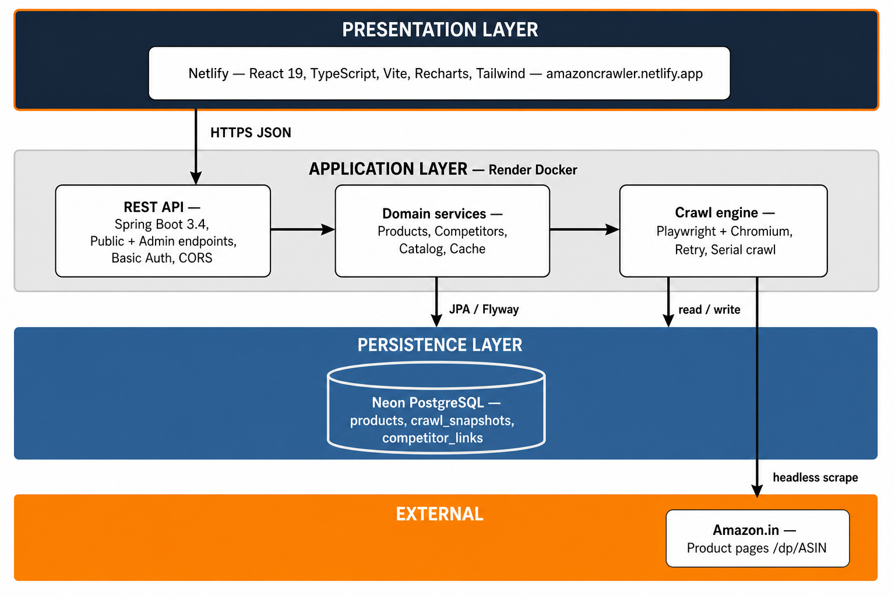
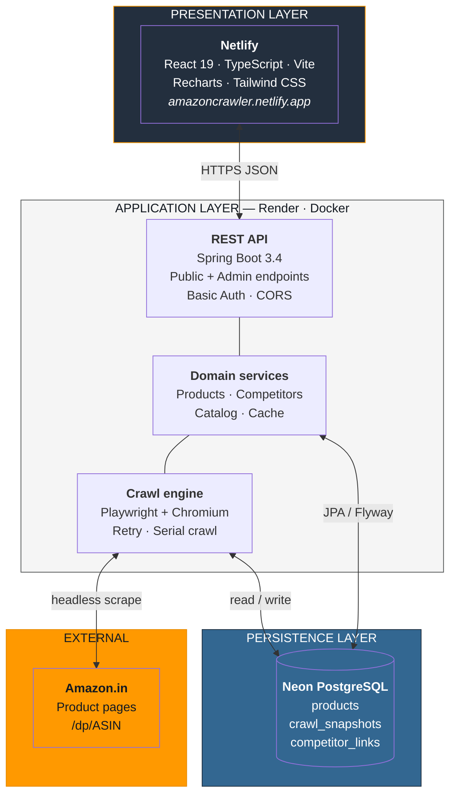

# Amazon Product Intelligence Platform

**A full-stack system to track your Amazon products, monitor competitors, and visualize price history over time.**

---

## Live demo

| | Link |
|---|------|
| **Web application** | [**https://amazoncrawler.netlify.app**](https://amazoncrawler.netlify.app) |
| **Backend API** | [https://amazoncrawlerbackend.onrender.com](https://amazoncrawlerbackend.onrender.com) |
| **API health** | [https://amazoncrawlerbackend.onrender.com/actuator/health](https://amazoncrawlerbackend.onrender.com/actuator/health) |
| **Frontend repository** | [github.com/HarshMishra3007/amazonCrawlerFrontend](https://github.com/HarshMishra3007/amazonCrawlerFrontend) |
| **Backend repository** | [github.com/HarshMishra3007/amazonCrawlerBackend](https://github.com/HarshMishra3007/amazonCrawlerBackend) |

**Admin panel:** [https://amazoncrawler.netlify.app/admin](https://amazoncrawler.netlify.app/admin)  
Use the credentials configured on Render (`ADMIN_USERNAME` / `ADMIN_PASSWORD`).

---

## Architecture (one page)

**For Google Docs:** insert the image below — open `docs/architecture-diagram.png` from this repo (Insert → Image → Upload from computer). Mermaid code blocks do not render in Google Docs.



<details>
<summary>Mermaid source (GitHub / VS Code only)</summary>



| Layer | Components | Responsibility |
|-------|------------|----------------|
| **Presentation** | React SPA on Netlify | Dashboard, charts, admin UI; calls backend via `VITE_API_URL` |
| **Application** | Spring Boot on Render | REST API, crawl orchestration, caching, security |
| **Persistence** | Neon PostgreSQL | Product catalog, price snapshots, competitor links |
| **External** | Amazon.in | Source of product data (scraped, not official API) |

---

## Tech stack

| Layer | Technology |
|-------|------------|
| Frontend | React 19, TypeScript, Vite, Tailwind CSS, Recharts, Axios |
| Backend | Java 17, Spring Boot 3.4, Spring Security, Spring Retry |
| Crawler | Playwright (headless Chromium) |
| Database | PostgreSQL (Neon) + Flyway migrations |
| Deploy | Netlify (UI) · Render (API + Docker) |

---

## Features

- Track **own products** and **competitors** by Amazon ASIN
- **Scheduled crawls** (every 6 hours) and **manual crawls** from admin
- **Price history chart** — one line per product/competitor from crawl snapshots
- **Competitor comparison** — current price and delta vs your product
- Bulk ASIN import, edit listing ID, auto-crawl on changes

---

## Important note: `FAILED` crawl status in production

You may see products with status **`FAILED`** (red badge) on the live demo at **https://amazoncrawler.netlify.app**. This is **expected** for this deployment model and is **not a bug in the application logic**.

### What `FAILED` means

The crawler could not extract product data (usually the product title) within the timeout. The database still records:

- `last_crawl_status = FAILED`
- `last_crawl_error` — e.g. `Timeout exceeded waiting for #productTitle`
- `last_crawl_at` — when the attempt finished

Previous successful data (name, price, history) is **kept**; failed crawls do **not** add new price history points.

### Why this happens on production (Render + cloud)

| Reason | Explanation |
|--------|-------------|
| **Amazon anti-bot** | Render uses **datacenter IPs**. Amazon often serves CAPTCHA, robot-check, or non-product pages to automated traffic. Those pages do not contain `#productTitle`, so Playwright times out. |
| **No official API** | The system uses **web scraping** (Playwright), not Amazon’s Product Advertising API. Scraping is inherently fragile on cloud hosts. |
| **Resource limits** | Headless Chromium on a small cloud instance is slower than a local machine; heavy Amazon pages increase timeout risk. |
| **Intermittent** | The same ASIN may succeed on one crawl and fail on the next. The backend **retries up to 3 times** with exponential backoff. |

### Why it works on local development

When you run the backend locally (`./run.sh`) and frontend (`npm run dev`):

- Traffic often comes from a **residential / home IP**, which Amazon treats more leniently.
- Your machine typically has **more CPU and RAM** for Chromium.
- Lower latency and no cold-start delays from free-tier cloud sleep.

So **local crawls usually succeed**; **production crawls may intermittently fail** — especially under assignment/demo load on Render.

### What we would do in a real production system

- Amazon **SP-API** instead of scraping  
- **Residential proxy** rotation (`CRAWLER_PROXY_URL`)  
- Dedicated crawler workers (EC2/ECS) with more memory  
- Alerting on repeated failures  
- Optional history limits to keep API responses bounded  

For this project/demo, occasional `FAILED` status correctly reflects real-world scraper behavior on cloud infrastructure.

---

## Quick test

```bash
# API health
curl https://amazoncrawlerbackend.onrender.com/actuator/health

# Product list (public)
curl https://amazoncrawlerbackend.onrender.com/api/products
```

---

## Local setup (full functionality)

```bash
# Backend
cd amazonCrawlerBackend
cp .env.example .env   # Neon credentials
./install-playwright.sh && ./run.sh

# Frontend
cd amazonCrawlerFrontend
npm install && npm run dev
# Open http://localhost:5173
```

---

*Amazon Product Intelligence Platform — assignment submission document.*
